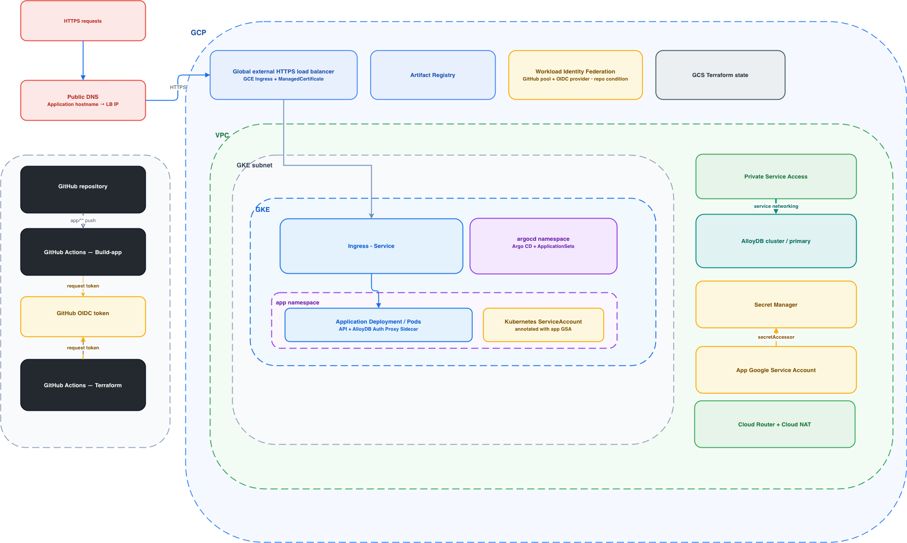
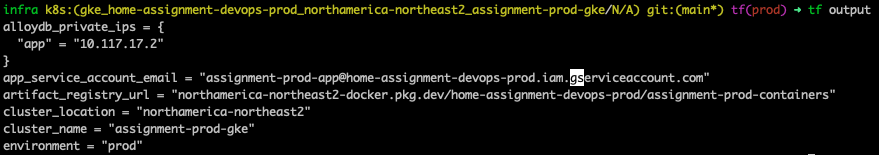
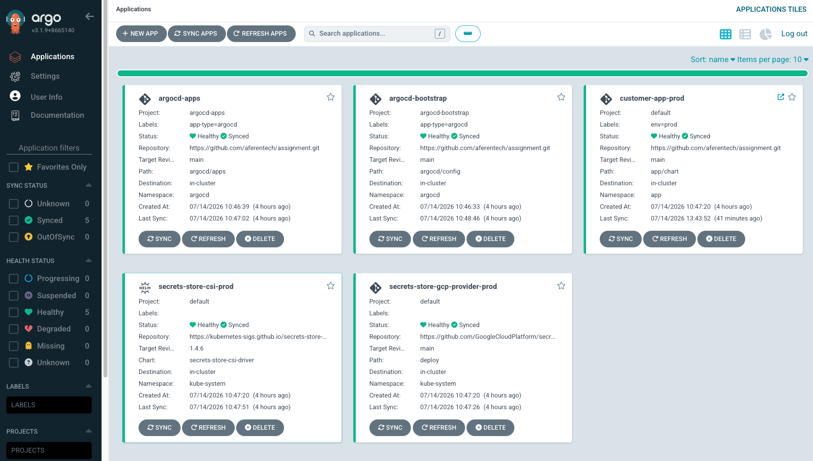
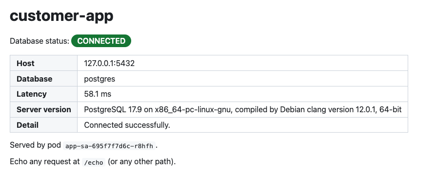

# Multi-Tenant SaaS Platform on GCP

This project implements the onboarding of a new tenant for a multi-tenant backend API service on Google Cloud Platform (GCP). The solution covers secure deployment of the backend service, private connectivity to a managed database, and automated deployments through a GitOps workflow.

| Requirement | Implementation |
|---|---|
| Compute | **GKE Standard** (private cluster, Workload Identity) |
| Database | **AlloyDB for PostgreSQL**, private (PSA, no public IP) |
| Secrets | **Secret Manager** with the Secrets Store CSI driver |
| Images | **Artifact Registry** |
| GitOps | **Argo CD** (app-of-apps plus ApplicationSets) |
| CI | **GitHub Actions**, keyless via Workload Identity Federation |
| State / envs | **GCS backend** with **Terraform workspaces** (`dev` / `prod`) |

---

## 1. Architecture overview



### Repository layout

```
.
├── app/                      # The tenant API
│   ├── main.py               # Python echo server + DB health report
│   ├── Dockerfile
│   └── chart/                # Helm chart (values.yaml + values-{dev,prod}.yaml)
├── iac/                      # Terraform
│   ├── bootstrap/            # One-time: GCS remote-state bucket
│   ├── infra/                # Root stack (dev/prod = workspace + tfvars)
│   └── modules/              # network, gke, alloydb, artifact-registry,
│                             # workload-identity, github-wif
├── argocd/
│   ├── deploy/               # Argo CD install (Helm umbrella chart)
│   ├── config/               # Root app-of-apps, AppProjects, repo creds
│   └── apps/                 # ApplicationSets: customer-app, CSI driver, provider
└── .github/workflows/        # build-app.yml, terraform.yml
```

---

## 2. Bootstrap from scratch

### Prerequisites
```bash
gcloud auth application-default login
```

### Step 1. Remote-state bucket (`iac/bootstrap`)
Creates the versioned GCS bucket that holds Terraform state. It uses local state, because it is the thing that creates the remote bucket.

```bash
cd iac/bootstrap
# edit terraform.tfvars: project_id, region, state_bucket_name
terraform init && terraform apply
```

### Step 2. Infrastructure (`iac/infra`)

```bash
cd ../infra
terraform init

terraform workspace new prod && terraform apply
terraform workspace new dev  && terraform apply
```

This provisions, per environment: VPC with Cloud NAT and PSA, a private GKE Standard cluster, AlloyDB cluster(s) with the password stored in Secret Manager, Artifact Registry, the app's Workload Identity service account, and the GitHub WIF pool/provider with its CI role grants.

### Step 3. Hand CI its credentials
In the GitHub repository, set the following secret and variables:
- `GCP_WIF_PROVIDER`
- `AR_REPOSITORY`
- `GCP_REGION`
- `GCP_PROJECT_ID`

### Step 4. Install Argo CD
Connect to the cluster and run these commands:
```bash
helm repo add argo https://argoproj.github.io/argo-helm
cd argocd/deploy
helm upgrade --install -f values-production.yaml argocd . -n argocd --create-namespace
```

From here Argo CD reconciles everything in `argocd/apps/` (the Secrets Store CSI driver, its GCP provider, and the customer-app) onto the cluster.

---

## 3. GitOps workflow, end to end

Argo CD runs in each cluster. A root app-of-apps (`argocd/config/argocd-apps.yaml`) watches `argocd/apps/` and adopts every ApplicationSet there. Each ApplicationSet uses a cluster generator: it emits one Application per registered cluster that carries an `env` label, and that label picks the Helm values file (`values-dev.yaml` or `values-prod.yaml`). So one definition serves all environments, with no copy-pasted per-env apps.

---

## 4. Design questions

### 1. Compute: why did I choose GKE Standard?

A multi-tenant platform designed to scale across many services is best served by a container orchestration platform. GKE Standard gives more control over the cluster configuration and infrastructure than Autopilot, which makes it easier to address platform-specific requirements, apply custom configuration, and avoid the restrictions that can arise in more opinionated managed environments.

### 2. Database connectivity: the private path from pod to database

AlloyDB has no public IP, and the path stays entirely inside Google's network:

1. AlloyDB is created on the VPC via Private Service Access (PSA), a reserved internal range peered with Google's managed-services network (`modules/network`). The instance gets a private IP there.
2. The app Pod runs an AlloyDB Auth Proxy sidecar. The app connects to `127.0.0.1:5432`, and the proxy opens an IAM-authenticated, TLS-encrypted connection to the AlloyDB private IP.
3. Traffic flows from the pod, through the VPC, across the PSA peering, to AlloyDB. It never touches the internet.

### 3. Credentials: no service-account key files

This uses GKE Workload Identity. Terraform creates a Google service account (GSA) per environment and binds the Kubernetes service account (`app/app-sa`) to it with `roles/iam.workloadIdentityUser`, and the KSA is annotated with the GSA email. When a pod calls a Google API, GKE's metadata server exchanges the pod's projected token for short-lived GSA credentials automatically. The GSA holds least-privilege roles: `roles/secretmanager.secretAccessor` on exactly its own DB-password secret(s), and `roles/alloydb.client`. CI uses the same keyless idea via Workload Identity Federation (see [WIF.md](./WIF.md)). There are no JSON keys anywhere.

### 4. Secrets: management and the git boundary

- The DB password is generated by Terraform (`random_password`), written as a Secret Manager version, and set as the AlloyDB user password, all in one apply, so the plaintext never appears in git or in an output.
- It is delivered to the pod by the Secrets Store CSI driver and its GCP provider, mounted read-only as a file (`/mnt/secrets/db-password`), and the app reads that file. The CSI driver authenticates as the pod (Workload Identity), so only authorized secrets can be mounted.
- Third-party API keys would be handled the same way: a Secret Manager container created by Terraform whose value is injected out of band and mounted as a file. This project currently needs only the DB password, so the extra secret-manager machinery was removed for simplicity.
- In git: Terraform, the Helm chart, Argo CD manifests, and secret references (names). Not in git: any secret value. The DB password lives only in Secret Manager and in Terraform state, which itself sits in a private, access-controlled bucket.

### 5. GitOps: step by step on a chart merge

A developer merges a change to the chart. Argo CD notices the new commit, renders the chart with that environment's values, diffs the result against live cluster state, and auto-syncs it (with `prune` and `selfHeal`). The in-cluster Argo CD controller applies it. Humans and CI never run `kubectl apply`.

### 6. Cost: dev-cheap, production-equivalent

Both environments share the same architecture (private cluster, private AlloyDB, Workload Identity, GitOps). Only the sizing differs, set in the `dev` and `prod` blocks of `iac/infra/terraform.tfvars`:

| Lever | dev | prod |
|---|---|---|
| Node pools | 1 pool, single-zone, `e2-standard-2` | 2 pools (`general` + `spot`), regional |
| Spot VMs | yes (roughly 60 to 80 percent cheaper) | on-demand `general` (optional spot) |
| Autoscaling floor | 1 node | 2 nodes |
| App replicas / HPA | 1 to 2, HPA off | 2 or more, HPA on |
| AlloyDB vCPU | 2 (minimum) | 4 |
| Deletion protection | off (easy teardown) | on |

Other choices: `pd-standard` disks, Cloud NAT instead of per-node public IPs, one shared state bucket, and one WIF provider hosted in prod that grants into both projects. The security posture (private DB, no keys, least-privilege IAM, GitOps) is identical to prod; only capacity and redundancy are dialed down.

---

## 5. AI usage

**What I prompted for**
- Scaffolding the whole Terraform modules, the GitHub Actions pipelines, the customer-api echo Python app, and the Helm templates.
- Setting up the GitHub to GCP Workload Identity Federation integration.
- Improving the README documentation.

**What I accepted as-is**
- AlloyDB with the auth-proxy sidecar pattern, the Secrets Store CSI delivery, and the Workload Identity bindings.
- The Python echo server code.

**What I changed or drove myself**
- The Argo CD app-of-apps design.
- The environment model iterations, until it matched how I wanted to run it, and enabling the WIF provider per environment.
- Reorganizing the Argo CD layout (`config/` for the app-of-apps and `apps/` for the ApplicationSets) and the chart path (`app/chart`).
- Reviewing and pruning: removed unused module outputs, simplified the CI-grants block (folded state-bucket access into project-level `ci_roles`), turned off HPA in dev, and similar cleanups.

---

## 6. Screenshots

### Terraform Output


### Argo CD


### Customer API

